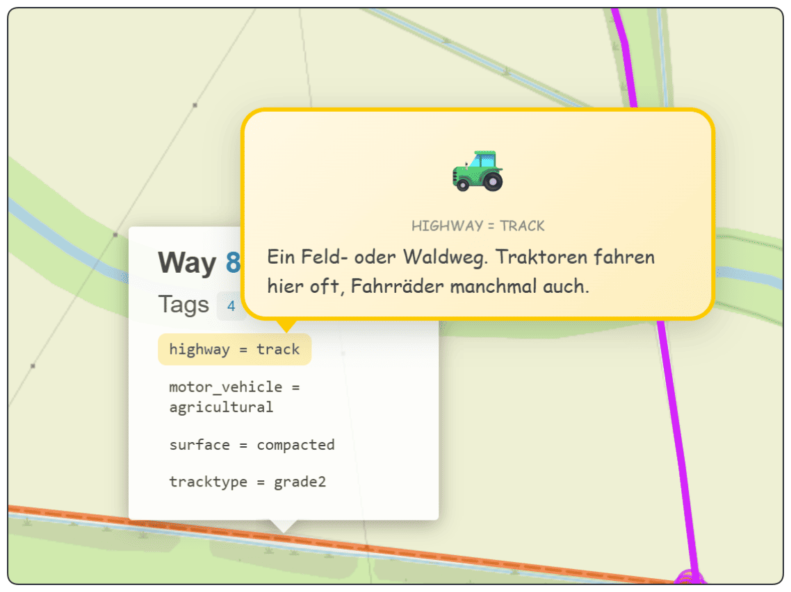
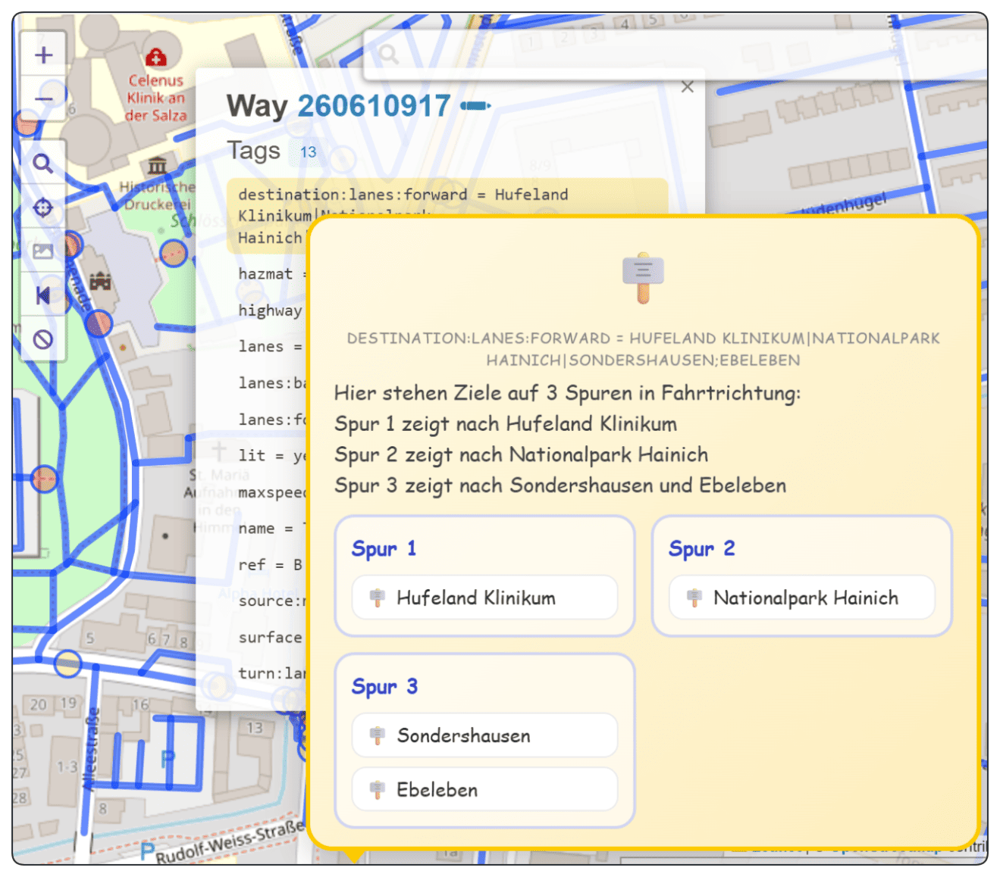

# OSM Kinder-Erklärer

Diese Version ist für die Chrome-Erweiterung **User JavaScript and CSS** vorbereitet.

## Erweiterung

**Chrome Web Store:**  
[User JavaScript and CSS](https://chromewebstore.google.com/detail/user-javascript-and-css/nbhcbdghjpllgmfilhnhkllmkecfmpld?pli=1)

## Programmansicht


## Beispiel



Beim Klick auf einen Weg in Overpass Turbo werden die Tags angezeigt.  
Wenn du anschließend mit der Maus auf einen einzelnen Tag gehst, blendet das Skript eine **kindgerechte Erklärung** ein.



## Beschreibung

Dieses Skript erweitert **Overpass Turbo** um kindgerechte Erklärungen für OSM-Tags.

Sobald in einem Popup Tags wie zum Beispiel:

- `highway = track`
- `surface = compacted`
- `tracktype = grade2`
- `cycleway = track`

angezeigt werden, kannst du mit der Maus darüberfahren. Dann erscheint ein Tooltip mit:

- Emoji
- Tagname
- Wert
- leicht verständlicher Erklärung

Das ist besonders praktisch, wenn man OSM-Daten Kindern, Einsteigern oder technisch weniger erfahrenen Menschen verständlich zeigen möchte.

## Funktionen

- erkennt Tags in Overpass-Turbo-Popups
- blendet bei Mauskontakt kindgerechte Erklärungen ein
- unterstützt viele OSM-Bereiche, zum Beispiel:
  - Straßenarten
  - Fahrradinfrastruktur
  - Oberflächen
  - Wegqualität
  - Verkehrszeichen
  - Gebäude
  - Natur
  - Gewässer
  - Orte und Einrichtungen
- arbeitet automatisch mit neu geöffneten Popups
- nutzt Emojis und leicht verständliche Texte

## Einrichten in der Erweiterung

### 1. Neue Regel anlegen
In **User JavaScript and CSS** eine neue Regel erstellen.

### 2. URL-Pattern festlegen

```text
https://overpass-turbo.eu/*
```

### 3. JavaScript einfügen
Den Inhalt von `osm-kinder-erklaerer-pro.js` in das linke JavaScript-Feld einfügen.

### 4. CSS einfügen
Den Inhalt von `osm-kinder-erklaerer-pro.css` in das rechte CSS-Feld einfügen.

### 5. Speichern
Auf **Save** klicken und Overpass Turbo neu laden.

## Beispielabfrage

```overpass
[out:json][timeout:120];
(
  relation["type"="route"]["route"="bicycle"](51.106305,10.631072,51.183,10.713657);
  relation["route"="bicycle"]["network"~"^(lcn|rcn|ncn)$"](51.106305,10.631072,51.183,10.713657);
  way["highway"~"cycleway|path|track|service|footway|living_street|residential|unclassified|tertiary|secondary|primary"](51.106305,10.631072,51.183,10.713657);
  way["bicycle_road"="yes"](51.106305,10.631072,51.183,10.713657);
  way["cyclestreet"="yes"](51.106305,10.631072,51.183,10.713657);
  way["cycleway"](51.106305,10.631072,51.183,10.713657);
);
out body;
>;
out geom qt;
```

## So benutzt du das Skript

1. Overpass Turbo öffnen
2. die Beispielabfrage einfügen
3. Abfrage ausführen
4. auf einen Weg oder ein Objekt klicken
5. im Popup mit der Maus über einen Tag fahren

Dann erscheint die Erklärung automatisch.

## Technische Hinweise

- das Skript beobachtet die Seite mit `MutationObserver`
- dadurch funktionieren auch neu erzeugte Popups
- vorhandene Popups beim Laden werden ebenfalls nachgerüstet
- die Tooltip-Inhalte werden sicher als HTML formatiert

## Enthaltene Dateien

- `osm-kinder-erklaerer-pro.js`
- `osm-kinder-erklaerer-pro.css`
- `README-osm-kinder-erklaerer-pro.md`

## Hinweis

Wenn Overpass Turbo seine HTML-Struktur ändert, muss das Skript eventuell angepasst werden.

## Lizenz

Private oder freie Nutzung nach Bedarf.
